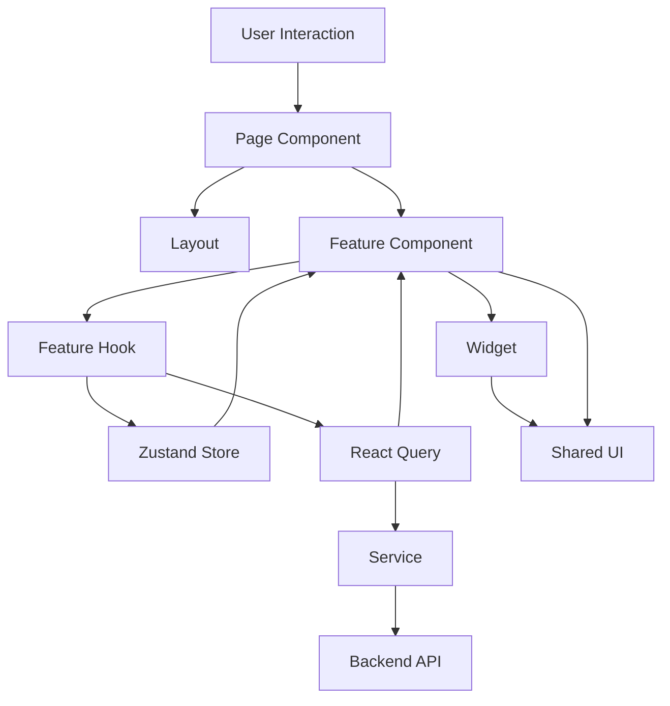
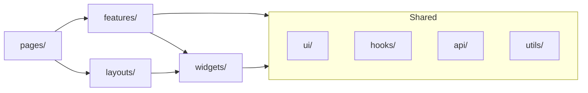

# Feature-based Architecture Migration Plan

## Архитектурные принципы

**Основа:** Feature-based подход с локальностью кода

- Каждая фича содержит всё необходимое: компоненты, hooks, store, services, utils, types
- `shared/` только для truly generic компонентов
- `widgets/` - UI-блоки без бизнес-логики
- `pages/` - только сборка фич + layout
- `layouts/` - композиция UI
- Зависимости: pages → features → widgets → shared (односторонние)

**State Management:** React Query (серверное) + Zustand (клиентское)

**Выявленные фичи:**

- `auth` - аутентификация и регистрация
- `projects` - управление проектами (CRUD)
- `project-workflow` - workflow создания видео (6 стейджей)
- `news` - работа с новостями и RSS
- `scripts` - библиотека скриптов
- `conveyor` - конвейер автоматизации
- `auto-scripts` - автоматическое создание скриптов
- `settings` - настройки приложения
- `instagram` - интеграция с Instagram

## Этап 1: Подготовка базовой структуры

### 1.1 Создание новых корневых папок

Создать следующую структуру в [`client/src/`](client/src/):

```
src/
├── app/                    # NEW
│   ├── providers/
│   ├── router.tsx
│   ├── App.tsx
│   └── index.tsx
├── layouts/                # NEW
├── features/               # NEW
├── widgets/                # NEW
└── shared/                 # NEW
    ├── ui/
    ├── hooks/
    ├── api/
    ├── utils/
    └── types/
```

### 1.2 Установка Zustand (если используется)

```bash
npm install zustand
```

### 1.3 Создание алиасов в tsconfig/vite

Обновить пути импортов для новой структуры:

- `@/app/*`
- `@/pages/*`
- `@/layouts/*`
- `@/features/*`
- `@/widgets/*`
- `@/shared/*`

## Этап 2: Миграция `app/` (точка входа)

### 2.1 Переместить провайдеры

**Источник:** [`client/src/App.tsx`](client/src/App.tsx)

Разбить на модули:

- `app/providers/QueryProvider.tsx` - QueryClientProvider
- `app/providers/AuthProvider.tsx` - из [`lib/auth-context.tsx`](client/src/lib/auth-context.tsx)
- `app/providers/ThemeProvider.tsx` - из [`components/theme-provider.tsx`](client/src/components/theme-provider.tsx)
- `app/providers/index.tsx` - экспорт всех провайдеров

### 2.2 Создать router

**Файл:** `app/router.tsx`

Вынести роутинг из `App.tsx` (строки 24-68)

```typescript
// app/router.tsx
export function Router() {
  // ... routing logic
}
```

### 2.3 Обновить App.tsx

**Новый путь:** `app/App.tsx`

Композиция провайдеров + роутер:

```typescript
// app/App.tsx
import { Providers } from './providers'
import { Router } from './router'

export default function App() {
  return (
    <Providers>
      <Router />
    </Providers>
  )
}
```

### 2.4 Создать точку входа

**Файл:** `app/index.tsx`

Переместить логику из [`main.tsx`](client/src/main.tsx)

## Этап 3: Миграция `shared/`

### 3.1 Переместить UI компоненты

**Источник:** [`components/ui/*`](client/src/components/ui/)

**Назначение:** `shared/ui/`

Все 45+ shadcn/ui компонентов перемещаются как есть.

### 3.2 Переместить generic hooks

**Источник:** [`hooks/*`](client/src/hooks/)

**Фильтр:** Только truly generic хуки

Переместить в `shared/hooks/`:

- `use-mobile.tsx` - определение mobile device
- `use-toast.ts` - toast notifications
- `use-sidebar.ts` - generic sidebar state (если используется в widgets)

**НЕ перемещать:**

- `use-app-store.ts` - перенести в features
- `use-auth.ts` - перенести в `features/auth/`

### 3.3 Создать shared/api

**Источник:** [`lib/query-client.ts`](client/src/lib/query-client.ts)

**Назначение:** `shared/api/`

```
shared/api/
├── http.ts           # apiRequest, ApiError
├── query-client.ts   # QueryClient config
└── index.ts
```

### 3.4 Создать shared/utils

**Источник:** [`lib/utils.ts`](client/src/lib/utils.ts)

**Назначение:** `shared/utils/utils.ts`

Добавить `shared/utils/index.ts` для реэкспорта.

### 3.5 Создать shared/types

**Источник:** Типы из `@shared/schema`

**Назначение:** `shared/types/`

```
shared/types/
├── project.ts      # Project, ProjectStatus
├── user.ts         # User
├── api.ts          # ApiError, ApiResponse
└── index.ts
```

## Этап 4: Миграция `layouts/`

### 4.1 Переместить layouts

**Источник:** [`components/layout/*`](client/src/components/layout/)

**Назначение:** `layouts/`

```
layouts/
├── AppLayout.tsx       # from app-layout.tsx
├── ProjectLayout.tsx   # from project-layout.tsx  
└── index.ts
```

Обновить импорты:

- `widgets/app-header/` вместо `@/components/layout/app-header`
- `widgets/main-navigation/` вместо `@/components/navigation/`
- `shared/ui/` вместо `@/components/ui/`

## Этап 5: Миграция `widgets/`

Widgets - это переиспользуемые UI-блоки БЕЗ бизнес-логики.

### 5.1 Создать widgets

**Источник:** [`components/layout/app-header.tsx`](client/src/components/layout/app-header.tsx)

**Назначение:** `widgets/app-header/`

```
widgets/
├── app-header/
│   ├── AppHeader.tsx
│   └── index.ts
├── main-navigation/
│   ├── MainNavigation.tsx
│   └── index.ts
└── project-sidebar/
    ├── ProjectSidebar.tsx
    ├── Timeline.tsx
    └── index.ts
```

### 5.2 Переместить UI-only компоненты проекта

**Источник:** [`components/project/*`](client/src/components/project/)

**Фильтр:** Только UI без бизнес-логики

Переместить в `widgets/project-sidebar/`:

- `timeline.tsx` - UI timeline
- `project-sidebar.tsx` - sidebar layout

**НЕ перемещать** (это feature-specific):

- `stage-content.tsx` - бизнес-логика
- `scene-editor/` - сложная бизнес-логика
- `analytics-column.tsx` - связано с фичей

## Этап 6: Миграция `features/auth`

Первая фича для миграции - самая простая и независимая.

### 6.1 Создать структуру

```
features/auth/
├── components/
│   ├── LoginForm.tsx
│   ├── PrivateRoute.tsx
│   └── index.ts
├── hooks/
│   ├── useAuth.ts
│   └── index.ts
├── services/
│   ├── authService.ts
│   └── index.ts
├── store/
│   └── authStore.ts (Zustand)
├── types.ts
└── index.ts
```

### 6.2 Переместить компоненты

**Источник:** [`components/auth/*`](client/src/components/auth/)

- `login-form.tsx` → `features/auth/components/LoginForm.tsx`
- `private-route.tsx` → `features/auth/components/PrivateRoute.tsx`

### 6.3 Создать authService

**Источник:** Логика из [`lib/auth-context.tsx`](client/src/lib/auth-context.tsx)

```typescript
// features/auth/services/authService.ts
export const authService = {
  login: async (email: string, password: string) => { ... },
  register: async (...) => { ... },
  logout: async () => { ... },
  me: async () => { ... },
}
```

### 6.4 Создать authStore (Zustand)

```typescript
// features/auth/store/authStore.ts
import { create } from 'zustand'

interface AuthState {
  user: User | null
  isAuthenticated: boolean
  setUser: (user: User | null) => void
  clearUser: () => void
}

export const useAuthStore = create<AuthState>((set) => ({
  user: null,
  isAuthenticated: false,
  setUser: (user) => set({ user, isAuthenticated: !!user }),
  clearUser: () => set({ user: null, isAuthenticated: false }),
}))
```

### 6.5 Создать useAuth hook

Объединяет store + React Query для проверки auth статуса.

```typescript
// features/auth/hooks/useAuth.ts
import { useQuery } from '@tanstack/react-query'
import { useAuthStore } from '../store/authStore'
import { authService } from '../services/authService'

export function useAuth() {
  const { user, setUser, clearUser } = useAuthStore()
  
  const { isLoading } = useQuery({
    queryKey: ['auth', 'me'],
    queryFn: authService.me,
    onSuccess: setUser,
    onError: clearUser,
  })
  
  return { user, isAuthenticated: !!user, isLoading }
}
```

### 6.6 Обновить импорты

Заменить все `@/hooks/use-auth` и `@/lib/auth-context` на `@/features/auth`

## Этап 7: Миграция `features/projects`

### 7.1 Создать структуру

```
features/projects/
├── components/
│   ├── ProjectCard.tsx
│   ├── ProjectsGrid.tsx
│   ├── ProjectsToolbar.tsx
│   ├── ProjectsEmptyState.tsx
│   ├── DeleteDialog.tsx
│   ├── RenameDialog.tsx
│   └── index.ts
├── hooks/
│   ├── useProjects.ts
│   ├── useProjectFilters.ts
│   ├── useProjectMutations.ts
│   └── index.ts
├── services/
│   └── projectsService.ts
├── types.ts
└── index.ts
```

### 7.2 Переместить компоненты

**Источник:** [`pages/home/components/*`](client/src/pages/home/components/)

Все компоненты из home переносятся в `features/projects/components/`

### 7.3 Переместить hooks

**Источник:** [`pages/home/hooks/*`](client/src/pages/home/hooks/)

- `use-projects.ts` → разделить на:
  - `hooks/useProjects.ts` (запросы)
  - `hooks/useProjectMutations.ts` (мутации)
- `use-project-filters.ts` → `hooks/useProjectFilters.ts`

### 7.4 Создать projectsService

```typescript
// features/projects/services/projectsService.ts
export const projectsService = {
  getAll: async () => { ... },
  create: async (data) => { ... },
  update: async (id, data) => { ... },
  delete: async (id) => { ... },
}
```

### 7.5 Обновить импорты

Обновить [`pages/home/Home.tsx`](client/src/pages/home/Home.tsx):

```typescript
// pages/home/Home.tsx (теперь только сборка)
import { Layout } from '@/layouts'
import { 
  ProjectsToolbar, 
  ProjectsGrid,
  DeleteDialog 
} from '@/features/projects'
```

## Этап 8: Миграция `features/project-workflow`

Самая сложная фича - workflow создания видео с 6 стейджами.

### 8.1 Создать структуру

```
features/project-workflow/
├── stages/
│   ├── SourceStage/
│   │   ├── SourceStage.tsx
│   │   ├── components/
│   │   ├── hooks/
│   │   └── index.ts
│   ├── ContentStage/
│   │   ├── ContentStage.tsx
│   │   ├── components/
│   │   │   ├── NewsView.tsx
│   │   │   ├── InstagramReelView.tsx
│   │   │   ├── CustomScriptInput.tsx
│   │   │   └── VideoScorePrediction.tsx
│   │   ├── hooks/
│   │   │   ├── useNewsAnalysis.ts
│   │   │   ├── useNewsFilters.ts
│   │   │   ├── useInstagramProcessing.ts
│   │   │   └── index.ts
│   │   ├── utils/
│   │   └── index.ts
│   ├── ScriptStage/
│   │   ├── ScriptStage.tsx
│   │   ├── components/
│   │   ├── hooks/
│   │   ├── constants/
│   │   └── index.ts
│   ├── VoiceStage/
│   ├── AvatarStage/
│   └── ExportStage/
├── components/
│   ├── StageContent.tsx
│   ├── SceneEditor/
│   └── index.ts
├── hooks/
│   ├── useProjectWorkflow.ts
│   ├── useWorkflowNavigation.ts
│   └── index.ts
├── store/
│   └── workflowStore.ts
├── services/
│   └── workflowService.ts
├── types.ts
└── index.ts
```

### 8.2 Переместить stages

**Источник:** [`components/project/stages/*`](client/src/components/project/stages/)

Каждый stage становится отдельной папкой:

- `stage-1-source-selection.tsx` → `stages/SourceStage/SourceStage.tsx`
- `stage-2-content-input.tsx` + `stage-2/*` → `stages/ContentStage/`
- `stage-3/` → `stages/ScriptStage/`
- `stage-4/` → `stages/VoiceStage/`
- `stage-5/` → `stages/AvatarStage/`
- `stage-6-export.tsx` → `stages/ExportStage/`

### 8.3 Переместить scene-editor

**Источник:** [`components/project/scene-editor/*`](client/src/components/project/scene-editor/)

**Назначение:** `features/project-workflow/components/SceneEditor/`

Всё содержимое с hooks внутри.

### 8.4 Создать workflowStore

```typescript
// features/project-workflow/store/workflowStore.ts
interface WorkflowState {
  currentStage: number
  projectId: string | null
  setStage: (stage: number) => void
  // ...
}

export const useWorkflowStore = create<WorkflowState>(...)
```

### 8.5 Создать workflowService

```typescript
// features/project-workflow/services/workflowService.ts
export const workflowService = {
  getProject: async (id: string) => { ... },
  updateStage: async (id: string, stage: number, data: any) => { ... },
  generateScript: async (projectId: string, ...) => { ... },
}
```

### 8.6 Обновить ProjectWorkflow page

**Файл:** [`pages/project/[id].tsx`](client/src/pages/project/[id].tsx)

Теперь только сборка:

```typescript
// pages/project/[id].tsx
import { ProjectLayout } from '@/layouts'
import { ProjectWorkflow } from '@/features/project-workflow'

export default function ProjectPage() {
  return (
    <ProjectLayout>
      <ProjectWorkflow />
    </ProjectLayout>
  )
}
```

## Этап 9: Миграция остальных features

### 9.1 Features/news

**Источник:**

- [`pages/news/*`](client/src/pages/news/)
- [`components/project/stages/stage-2/components/News*`](client/src/components/project/stages/stage-2/components/)
```
features/news/
├── components/
│   ├── NewsCard.tsx
│   ├── NewsList.tsx
│   └── index.ts
├── hooks/
│   ├── useNews.ts
│   ├── useNewsMutations.ts
│   └── index.ts
├── services/
│   └── newsService.ts
└── index.ts
```


### 9.2 Features/scripts

**Источник:** [`pages/scripts/*`](client/src/pages/scripts/)

```
features/scripts/
├── components/
│   ├── ScriptsList.tsx
│   ├── ScriptCreate.tsx
│   └── index.ts
├── hooks/
│   └── useScripts.ts
├── services/
│   └── scriptsService.ts
└── index.ts
```

### 9.3 Features/conveyor

**Источник:** [`pages/conveyor/*`](client/src/pages/conveyor/)

```
features/conveyor/
├── components/
│   ├── ConveyorDashboard.tsx
│   ├── AgentThinkingSidebar.tsx
│   └── index.ts
├── hooks/
│   ├── useConveyorEvents.ts
│   └── index.ts
├── services/
│   └── conveyorService.ts
└── index.ts
```

### 9.4 Features/settings

**Источник:** [`pages/settings/*`](client/src/pages/settings/)

```
features/settings/
├── components/
│   ├── ApiKeysSection.tsx
│   ├── ConveyorSettingsSection/
│   ├── InstagramSourcesSection.tsx
│   ├── RssSourcesSection.tsx
│   └── index.ts
├── hooks/
│   ├── useApiKeys.ts
│   ├── useConveyorSettings.ts
│   ├── useInstagramSources.ts
│   ├── useRssSources.ts
│   └── index.ts
├── services/
│   └── settingsService.ts
├── constants.ts
└── index.ts
```

### 9.5 Features/auto-scripts

**Источник:** [`pages/auto-scripts/*`](client/src/pages/auto-scripts/)

```
features/auto-scripts/
├── components/
│   ├── RevisionProgress.tsx
│   ├── RevisionStatus.tsx
│   └── index.ts
├── hooks/
│   ├── useRevisionProgress.ts
│   └── index.ts
├── utils/
│   └── revision-stages.ts
└── index.ts
```

### 9.6 Features/instagram

**Источник:** [`components/ig-analytics/*`](client/src/components/ig-analytics/)

```
features/instagram/
├── components/
│   ├── AccountConnection.tsx
│   ├── MediaList.tsx
│   ├── AiRecommendations.tsx
│   └── index.ts
├── hooks/
│   └── useInstagram.ts
├── services/
│   └── instagramService.ts
└── index.ts
```

## Этап 10: Обновление pages/

После миграции всех фич, `pages/` должны содержать ТОЛЬКО сборку.

### 10.1 Структура pages/

```
pages/
├── home/
│   ├── HomePage.tsx
│   └── index.ts
├── project/
│   ├── ProjectPage.tsx
│   ├── NewProjectPage.tsx
│   └── index.ts
├── news/
│   ├── NewsPage.tsx
│   └── index.ts
├── scripts/
│   ├── ScriptsPage.tsx
│   └── index.ts
├── conveyor/
│   ├── ConveyorPage.tsx
│   └── index.ts
├── settings/
│   ├── SettingsPage.tsx
│   └── index.ts
├── landing/
│   ├── LandingPage.tsx
│   └── index.ts
└── not-found/
    ├── NotFoundPage.tsx
    └── index.ts
```

### 10.2 Паттерн Page компонента

Каждая страница следует паттерну:

```typescript
// pages/home/HomePage.tsx
import { AppLayout } from '@/layouts'
import { ProjectsGrid, ProjectsToolbar } from '@/features/projects'

export default function HomePage() {
  return (
    <AppLayout>
      <div className="container">
        <h1>Projects</h1>
        <ProjectsToolbar />
        <ProjectsGrid />
      </div>
    </AppLayout>
  )
}
```

## Этап 11: Очистка старой структуры

После успешной миграции всех фич и проверки работоспособности:

### 11.1 Удалить старые папки

```
client/src/
├── components/       # DELETE (кроме ui/ если оставляем)
│   ├── auth/        # → features/auth
│   ├── layout/      # → layouts/
│   ├── project/     # → features/project-workflow
│   ├── scripts/     # → features/scripts
│   └── ...
├── lib/             # PARTIAL DELETE
│   ├── auth-context.tsx  # → features/auth
│   └── services/         # → features/*/services
```

### 11.2 Обновить index.css

**Файл:** [`client/src/index.css`](client/src/index.css)

Переместить в `styles/globals.css` или оставить в корне, но обновить импорты.

### 11.3 Обновить все абсолютные импорты

Запустить глобальный поиск и замену:

- `@/components/ui/` → `@/shared/ui/`
- `@/hooks/use-auth` → `@/features/auth`
- `@/lib/utils` → `@/shared/utils`
- и т.д.

## Этап 12: Оптимизация и документация

### 12.1 Добавить index.ts во все фичи

Каждая фича должна иметь `index.ts` с именованными экспортами:

```typescript
// features/projects/index.ts
export * from './components'
export * from './hooks'
export * from './types'
```

### 12.2 Создать README для каждой фичи

```markdown
# Feature: Projects

## Описание
Управление проектами: создание, редактирование, удаление

## Зависимости
- `@/features/auth` - проверка авторизации
- `@/shared/ui` - UI компоненты

## Компоненты
- `ProjectCard` - карточка проекта
- `ProjectsGrid` - сетка проектов

## Hooks
- `useProjects()` - получение списка проектов
- `useProjectMutations()` - CRUD операции
```

### 12.3 Обновить основной README

Добавить описание новой архитектуры в корневой README.md проекта.

### 12.4 Настроить ESLint rules

Добавить правила для контроля зависимостей:

```json
{
  "rules": {
    "no-restricted-imports": ["error", {
      "patterns": [
        {
          "group": ["@/features/*"],
          "message": "Features should not import from other features"
        }
      ]
    }]
  }
}
```

## Диаграмма потока данных



## Диаграмма зависимостей слоёв



## Чеклист миграции

После завершения каждого этапа проверить:

1. Приложение запускается без ошибок
2. Все страницы доступны и работают
3. Нет ошибок в консоли браузера
4. TypeScript компилируется без ошибок
5. Тесты проходят (если есть)
6. Импорты используют новую структуру
7. Нет циклических зависимостей

## Критические файлы для миграции

**Высокий приоритет:**

- [`client/src/App.tsx`](client/src/App.tsx) - основной роутинг
- [`client/src/lib/auth-context.tsx`](client/src/lib/auth-context.tsx) - аутентификация
- [`client/src/pages/project/[id].tsx`](client/src/pages/project/[id].tsx) - основной workflow
- [`client/src/components/project/stages/*`](client/src/components/project/stages/) - stages workflow

**Средний приоритет:**

- [`client/src/pages/home/Home.tsx`](client/src/pages/home/Home.tsx) - главная страница
- [`client/src/pages/settings/`](client/src/pages/settings/) - настройки
- [`client/src/components/layout/`](client/src/components/layout/) - layouts

**Низкий приоритет:**

- [`client/src/pages/landing.tsx`](client/src/pages/landing.tsx) - landing page
- [`client/src/pages/not-found.tsx`](client/src/pages/not-found.tsx) - 404 page

## Рекомендации по порядку выполнения

1. **Этапы 1-3** (Подготовка, app/, shared/) - базис для всего
2. **Этапы 4-5** (layouts/, widgets/) - независимые UI компоненты
3. **Этап 6** (features/auth) - критичная фича, нужна для всех остальных
4. **Этап 7** (features/projects) - простая фича для проверки паттерна
5. **Этап 8** (features/project-workflow) - самая сложная, после освоения паттерна
6. **Этап 9** (остальные features) - параллельно или последовательно
7. **Этапы 10-12** (pages, cleanup, docs) - финализация

## Оценка сложности

- **Этапы 1-5:** Низкая сложность, механическое перемещение
- **Этап 6 (auth):** Средняя сложность, требует внимания к зависимостям
- **Этап 7 (projects):** Средняя сложность
- **Этап 8 (project-workflow):** Высокая сложность, много вложенной логики
- **Этапы 9-12:** Низкая-средняя сложность

## Риски и митигация

**Риск:** Нарушение работы приложения во время миграции

**Митигация:** Инкрементальный подход, проверка после каждого этапа

**Риск:** Циклические зависимости между features

**Митигация:** Строгие правила импортов, ESLint настройки

**Риск:** Потеря функциональности при разделении компонентов

**Митигация:** Тщательное тестирование, создание чек-листов

**Риск:** Путаница с путями импортов

**Митигация:** Обновление tsconfig, использование абсолютных путей с алиасами