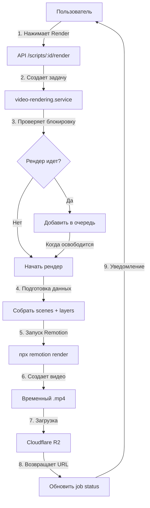

# План реализации рендеринга видео через Remotion + FFMPEG

## Архитектура решения

Используется подход **Remotion Bundle + FFMPEG** для рендеринга на собственном сервере:



## Основные компоненты

### 1. Серверный рендеринг (Backend)

#### Файл: `server/modules/video-rendering/video-rendering.service.ts`

**Изменения:**

- Удалить mock-методы (`mockRenderProcess`, `generateMockVideoUrl`)
- Реализовать настоящий рендеринг через Remotion CLI
- Добавить блокировку для последовательного рендеринга (флаг `isRenderingInProgress`)
- Добавить очередь в памяти для ожидающих задач
- Интегрировать FFMPEG для финальной обработки (если нужны дополнительные эффекты)
- Добавить очистку временных файлов после загрузки в R2

**Основной workflow:**

```typescript
// 1. Проверка блокировки
if (isRenderingInProgress) {
  renderQueue.push(jobId);
  return { status: "queued", position: renderQueue.length };
}

// 2. Установка блокировки
isRenderingInProgress = true;

// 3. Подготовка inputProps для Remotion
const inputProps = {
  scenes: enhancedScenes,
  backgroundColor: "#000000",
};

// 4. Запуск Remotion CLI
await execPromise(
  `npx remotion render Root VideoEditor ${tempOutputPath} --props='${JSON.stringify(inputProps)}'`,
);

// 5. Загрузка в R2
const videoBuffer = await fs.readFile(tempOutputPath);
const r2Path = `users/${userId}/projects/${projectId}/rendered/video-${scriptId}-${Date.now()}.mp4`;
const videoUrl = await storageRepo.uploadWithPath(
  videoBuffer,
  r2Path,
  "video/mp4",
);

// 6. Очистка и снятие блокировки
await fs.unlink(tempOutputPath);
isRenderingInProgress = false;
processNextInQueue();
```

#### Файл: `server/modules/video-rendering/remotion.config.ts` (новый)

Создать конфигурацию Remotion для серверного рендеринга:

```typescript
import { Config } from "@remotion/cli/config";

Config.setVideoImageFormat("jpeg");
Config.setOverwriteOutput(true);
Config.setConcurrency(2); // Для 10 пользователей достаточно
Config.setCodec("h264");
```

### 2. API эндпоинты

Файл `[server/modules/video-rendering/video-rendering.routes.ts](server/modules/video-rendering/video-rendering.routes.ts)` уже содержит нужные роуты:

- `POST /api/scripts/:scriptId/render` - запуск рендеринга
- `GET /api/scripts/:scriptId/render/:jobId/status` - статус задачи
- `GET /api/render/jobs` - список всех задач пользователя
- `DELETE /api/render/jobs/:jobId` - отмена задачи

**Дополнительно добавить:**

- `GET /api/scripts/:scriptId/render/:jobId/download` - получение download URL
- `GET /api/scripts/:scriptId/render/:jobId/preview` - получение presigned URL для просмотра

### 3. Frontend интеграция

#### Файл: `client/src/features/conveyor/components/video-editor/export/ExportVideoSection.tsx` (обновить)

**Добавить:**

1. Кнопку "Render Video"
2. Индикатор прогресса рендеринга
3. Состояние рендеринга (pending, processing, completed, failed)
4. Polling для обновления статуса каждые 2-3 секунды
5. После завершения: кнопки "Download" и "Preview"

**Пример UI:**

```typescript
// Состояния рендеринга
const [renderJob, setRenderJob] = useState<RenderJob | null>(null);
const [isPolling, setIsPolling] = useState(false);

// Запуск рендеринга
const handleStartRender = async () => {
  const response = await api.post(`/api/scripts/${scriptId}/render`, {
    width: 1920,
    height: 1080,
    fps: 30,
    format: "mp4",
    quality: "high",
  });
  setRenderJob(response.data);
  startPolling(response.data.jobId);
};

// Polling статуса
const startPolling = (jobId: string) => {
  const interval = setInterval(async () => {
    const status = await api.get(
      `/api/scripts/${scriptId}/render/${jobId}/status`,
    );
    setRenderJob(status.data);

    if (status.data.status === "completed" || status.data.status === "failed") {
      clearInterval(interval);
      setIsPolling(false);
    }
  }, 3000);
};
```

#### Компонент прогресса: `client/src/features/conveyor/components/video-editor/export/RenderProgressCard.tsx` (новый)

Отображение:

- Прогресс-бар (0-100%)
- Статус ("Рендеринг кадров...", "Обработка аудио...", "Загрузка в облако...")
- Позиция в очереди (если есть)
- Расчетное время до завершения
- Кнопка "Cancel" для отмены

#### Компонент просмотра: `client/src/features/conveyor/components/video-editor/export/VideoPreviewPlayer.tsx` (новый)

HTML5 video player для просмотра готового видео:

```tsx
<video
  src={videoUrl}
  controls
  className="w-full aspect-video"
  preload="metadata"
>
  Ваш браузер не поддерживает видео
</video>

<div className="flex gap-2 mt-4">
  <Button onClick={handleDownload}>
    <Download /> Скачать видео
  </Button>
  <Button variant="outline" onClick={handleShare}>
    <Share2 /> Поделиться
  </Button>
</div>
```

### 4. Переменные окружения

Добавить в `[.env](.env)` и `[.env.example](.env.example)`:

```env
# Video Rendering Configuration
REMOTION_TEMP_DIR=./temp/remotion
REMOTION_CONCURRENCY=2
REMOTION_TIMEOUT=1800000  # 30 минут в миллисекундах

# R2 Storage (уже настроено)
R2_BUCKET_NAME=your-bucket
R2_ENDPOINT=https://xxx.r2.cloudflarestorage.com
R2_ACCESS_KEY_ID=xxx
R2_SECRET_ACCESS_KEY=xxx
```

### 5. Remotion Root компонент

Файл `[client/src/features/conveyor/remotion/Root.tsx](client/src/features/conveyor/remotion/Root.tsx)` уже готов и экспортирует композицию `VideoEditor`.

**Важно:** Убедиться что этот файл используется как entry point для Remotion CLI.

Создать файл `client/src/features/conveyor/remotion/index.ts`:

```typescript
export { RemotionRoot as Root } from "./Root";
export { SceneComposition } from "./SceneComposition";
```

### 6. Управление очередью

Файл: `server/modules/video-rendering/render-queue.ts` (новый)

Простая очередь в памяти:

```typescript
class RenderQueue {
  private queue: string[] = [];
  private isProcessing = false;

  enqueue(jobId: string): number {
    this.queue.push(jobId);
    return this.queue.length;
  }

  dequeue(): string | undefined {
    return this.queue.shift();
  }

  async processNext(): Promise<void> {
    if (this.isProcessing || this.queue.length === 0) {
      return;
    }

    this.isProcessing = true;
    const jobId = this.dequeue();

    if (jobId) {
      await videoRenderingService.processRenderJob(jobId);
    }

    this.isProcessing = false;

    // Обработать следующую задачу
    if (this.queue.length > 0) {
      this.processNext();
    }
  }

  getPosition(jobId: string): number {
    return this.queue.indexOf(jobId) + 1;
  }

  cancel(jobId: string): boolean {
    const index = this.queue.indexOf(jobId);
    if (index !== -1) {
      this.queue.splice(index, 1);
      return true;
    }
    return false;
  }
}

export const renderQueue = new RenderQueue();
```

### 7. Оптимизация для 10 пользователей/день

**Настройки производительности:**

- `REMOTION_CONCURRENCY=2` - рендерить 2 кадра параллельно
- Таймаут: 30 минут на видео (достаточно для 5-минутного ролика)
- Использовать JPEG для кадров (быстрее PNG)
- Очистка временных файлов после каждого рендера
- Compression level: balanced (не максимальный, для скорости)

**Ресурсы сервера (минимум):**

- CPU: 4 ядра
- RAM: 8 GB
- Диск: 50 GB SSD
- Временное хранилище: ~15-20 GB на пиковую нагрузку

## Последовательность реализации

### Шаг 1: Настройка окружения

- Установить FFMPEG на сервер
- Добавить переменные окружения
- Создать директорию для временных файлов

### Шаг 2: Обновление сервиса рендеринга

- Удалить mock-методы
- Реализовать интеграцию с Remotion CLI
- Добавить систему блокировки и очереди
- Добавить обработку ошибок и retry логику

### Шаг 3: API эндпоинты

- Добавить роуты для download и preview
- Реализовать presigned URL генерацию
- Добавить валидацию прав доступа

### Шаг 4: Frontend компоненты

- Создать кнопку запуска рендеринга
- Реализовать индикатор прогресса с polling
- Добавить video player для просмотра
- Добавить кнопку скачивания

### Шаг 5: Тестирование

- Протестировать рендеринг одного видео
- Протестировать очередь (2-3 видео подряд)
- Проверить загрузку в R2
- Проверить скачивание и просмотр

### Шаг 6: Мониторинг и логирование

- Добавить детальное логирование процесса
- Настроить алерты на зависшие рендеры
- Добавить метрики (время рендеринга, размер файлов)

## Оценка времени рендеринга

Для 5-минутного видео (9000 кадров при 30 FPS):

- Рендеринг кадров: ~20-30 минут
- FFMPEG обработка: ~2-3 минуты
- Загрузка в R2 (500 MB): ~30-60 секунд
- **Итого: ~25-35 минут на видео**

При 10 пользователях/день и последовательной обработке:

- Максимальная нагрузка: ~6 часов рендеринга/день
- Укладывается в рабочее время сервера

## Важные замечания

1. **Remotion Bundle vs CLI:** Используется CLI подход для простоты, bundle будет использоваться только на клиенте для preview
2. **Без Lambda:** Весь рендеринг на собственном сервере, AWS не требуется
3. **Простая очередь:** Достаточно флага в памяти для 10 пользователей, Redis не нужен
4. **Временные файлы:** Обязательно очищать после каждого рендера (экономия места)
5. **Presigned URLs:** Для безопасности используются временные ссылки на 24 часа
