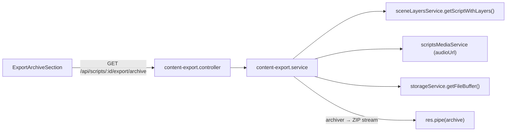

# Скачивание архива с контентом сцен

## Архитектура



## Структура ZIP-архива

```
script-{title}/
  script.txt              # Полный текст скрипта (все сцены)
  scene-01/
    text.txt              # Текст этой сцены
    audio.mp3             # Аудио сцены (если есть)
    background.{ext}      # Фон сцены (если есть)
    overlay.{ext}         # Оверлей сцены (если есть)
  scene-02/
    ...
  audio-full.mp3          # Полное аудио скрипта (если есть)
```

## Серверная часть

### 1. Новый модуль `server/modules/content-export/`

- `content-export.service.ts` — основная логика:
  - Получает `scriptWithLayers` через существующий `sceneLayersService.getScriptWithLayers(scriptId, userId)`
  - Получает `scriptsMedia` для полного аудио
  - Для каждой сцены собирает URL медиа-файлов из слоёв (`background.sourceUrl`, `overlay.sourceUrl`, `scene.audioUrl`)
  - Скачивает файлы из R2 через `storageService.getFileBuffer(key)` + `extractKeyFromUrl(url)`
  - Формирует ZIP через библиотеку `archiver` (потоковая генерация, без записи на диск)
- `content-export.controller.ts` — контроллер:
  - `GET /api/scripts/:scriptId/export/archive` — стримит ZIP в response
  - Устанавливает заголовки: `Content-Type: application/zip`, `Content-Disposition: attachment; filename="..."`
- `content-export.routes.ts` — регистрация маршрутов

### 2. Зависимость

Добавить `archiver` (npm-пакет для потоковой генерации ZIP) + `@types/archiver`

## Клиентская часть

### 3. Компонент `ExportArchiveSection.tsx`

Новый компонент в `client/src/features/conveyor/components/video-editor/export/`:

- Кнопка "Скачать архив с контентом"
- Индикатор загрузки (скачивание может занять время)
- Информация о содержимом архива (кол-во сцен, наличие аудио/медиа)

### 4. Обновить `VideoEditorExport.tsx`

- Добавить `ExportArchiveSection` вместо секции Remotion-рендеринга
- Импортировать новый компонент

### 5. Закомментировать Remotion-рендеринг в `ExportVideoSection.tsx`

- Закомментировать блок "Remotion Рендеринг" (строки 311-362) — весь JSX секции
- Закомментировать связанные state/handlers (`renderJob`, `handleStartRender`, `handleCancelRender`, `handleDownloadRendered`, polling)
- Оставить HeyGen секцию как есть (если используется)
- Серверный модуль `server/modules/video-rendering/` НЕ удаляем, НЕ трогаем

## Ключевые файлы для переиспользования

- `[server/modules/scene-layers/scene-layers.service.ts](server/modules/scene-layers/scene-layers.service.ts)` — `getScriptWithLayers()` для получения всех сцен с слоями
- `[server/modules/storage/storage.service.ts](server/modules/storage/storage.service.ts)` — `getFileBuffer()` и `extractKeyFromUrl()` для скачивания файлов из R2
- `[server/routes.ts](server/routes.ts)` — регистрация нового маршрута (строка ~98)
