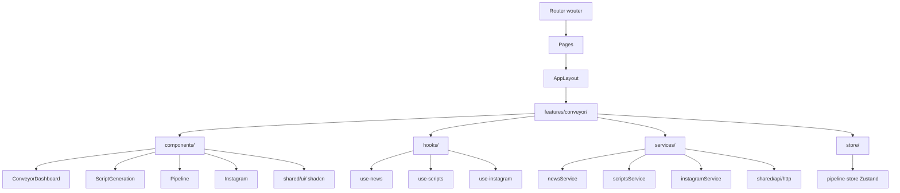

# План обновления клиентской части конвейера

## Обзор изменений

Обновление конвейера с переносом функционала из [client/newConveyor](client/newConveyor) в существующую архитектуру [client/src](client/src). Новый функционал включает:

- Расширенный дашборд конвейера
- AI-генерация сценариев с итеративной доработкой (scriptwriter → editor)
- Управление черновиками и готовыми сценариями

## Архитектурные принципы

Сохранение текущей архитектуры:

- Feature-based структура (`features/conveyor/`)
- Использование Wouter для роутинга (не React Router)
- Использование shadcn/ui компонентов из `shared/ui/`
- React Query для API запросов
- Централизованные сервисы в `features/*/services/`
- `Store для обмена данными между компонентами, минимально пропсов, Zustand`

## 1. Обновление типов

**Файлы для обновления:**

- `client/src/features/conveyor/types.ts` (новый файл)

**Действия:**

Перенести типы из [client/newConveyor/types/index.ts](client/newConveyor/types/index.ts):

```typescript
export interface NewsItem {
  id: string
  title: string
  content: string | null
  source: string | null
  url: string | null
  aiScore: number | null
  status: 'new' | 'scored' | 'selected' | 'used' | 'dismissed'
  publishedAt: string | null
  createdAt: string
}

export interface Script {
  id: string
  newsId: string
  newsTitle: string
  scenes: Scene[]
  status: 'draft' | 'review' | 'completed'
  sourceType: 'rss' | 'instagram'
  score: number
  hasAudio: boolean
  hasAvatar: boolean
}

export interface Scene {
  id: string
  order: number
  text: string
  visualSource?: string | null
  mediaType?: 'image' | 'video'
  durationInFrames?: number
  // ... остальные поля для Pipeline
}

export interface NewsScript {
  id: string
  newsTitle: string
  status: 'pending' | 'in_progress' | 'completed' | 'human_review'
  currentIteration: number
  iterations: Iteration[]
}

export interface AISettings {
  provider: 'anthropic' | 'deepseek'
  scriptwriterPrompt: string
  editorPrompt: string
  maxIterations: number
  autoSendToHumanReview: boolean
}
```

## 2. Обновление сервисов API

**Файлы:**

- `client/src/features/conveyor/services/conveyorService.ts` - расширить существующий
- `client/src/features/conveyor/services/newsService.ts` - новый
- `client/src/features/conveyor/services/scriptsService.ts` - новый

**Источники:**

- [client/newConveyor/lib/services/news.ts](client/newConveyor/lib/services/news.ts)
- [client/newConveyor/lib/services/scripts.ts](client/newConveyor/lib/services/scripts.ts)[](client/newConveyor/lib/services/instagram.ts)

**Важно:**

- Удалить моковые данные из instagram.ts
- Адаптировать к текущей системе HTTP клиента из `shared/api/http.ts`
- Сохранить SSE подписки для генерации скриптов

## 3. Создание хуков

**Новые хуки в `client/src/features/conveyor/hooks/`:**

`use-news.ts`:

```typescript
export function useNews(params?: { status?: string, limit?: number }) {
  return useQuery({
    queryKey: ['news', params],
    queryFn: () => newsService.getNews(params),
  })
}

export function useNewsActions() {
  const queryClient = useQueryClient()
  
  return {
    refreshNews: useMutation({
      mutationFn: newsService.refreshNews,
      onSuccess: () => queryClient.invalidateQueries(['news'])
    }),
    scoreNews: useMutation({ ... }),
    updateStatus: useMutation({ ... })
  }
}
```

`use-scripts.ts`:

```typescript
export function useScripts(params?: { status?: string }) {
  return useQuery({
    queryKey: ['scripts', params],
    queryFn: () => scriptsService.getScripts(params)
  })
}

export function useScriptGeneration(scriptId: string) {
  const [events, setEvents] = useState([])
  
  useEffect(() => {
    const unsubscribe = scriptsService.subscribeToGeneration(
      scriptId,
      (event) => setEvents(prev => [...prev, event])
    )
    return unsubscribe
  }, [scriptId])
  
  return { events }
}
```

## 4. Обновление компонентов

### 4.1 ConveyorDashboard

**Файл:** `client/src/features/conveyor/components/ConveyorDashboard.tsx`

**Изменения:**

- Добавить статистику из [client/newConveyor/pages/Conveyor.tsx](client/newConveyor/pages/Conveyor.tsx):
  - Спарсено новостей
  - Проанализировано
  - Сценариев написано (клик → ScriptGeneration)
  - На рецензии (клик → ScriptsReview)
- Добавить секцию "Сценарии на рецензии"
- Использовать компоненты из `shared/ui/` (Card, Badge, Button)
- Не сохранять AgentThinkingSidebar
- Оставить и адаптировать под новый дизайн шапку с запуском конвейера и кнопкой "настройки"

### 4.2 Новые страницы

Создать в `client/src/pages/conveyor/`:

**drafts.tsx** - черновики скриптов:

```typescript
import { AppLayout } from '@/layouts'
import { DraftsPage } from '@/features/conveyor/components/DraftsPage'

export default function Drafts() {
  return (
    <AppLayout>
      <DraftsPage />
    </AppLayout>
  )
}
```

**scripts.tsx** - готовые скрипты

**script-generation.tsx** - AI генерация

script-editor.tsx - редактор сценария

**scripts-review.tsx** - ревью скриптов

### 4.3 Новые feature компоненты

Создать в `client/src/features/conveyor`:

**DraftsPage.tsx** - адаптация [client/newConveyor/pages/Drafts.tsx](client/newConveyor/pages/Drafts.tsx)

**ScriptsPage.tsx** - адаптация [client/newConveyor/pages/Scripts.tsx](client/newConveyor/pages/Scripts.tsx)

**ScriptGenerationPage.tsx** - адаптация [client/newConveyor/pages/ScriptGenerationPage.tsx](client/newConveyor/pages/ScriptGenerationPage.tsx)

**ScriptsReviewPage.tsx** - адаптация client/newConveyor/pages/ScriptsReview.tsx

ScriptEditorPage.tsx - адаптация client/newConveyor/pages/ScriptsEditor.tsx

Создать в `client/src/features/conveyor/components`:

**Вложенные компоненты** (`components/script-generation/`) для ScriptGenerationPage:

- AISettingsPanel.tsx
- NewsScriptList.tsx
- NewsScriptCard.tsx
- IterationTimeline.tsx
- ReviewBlock.tsx
- ScriptVersionBlock.tsx

Отдельные компоненты, которые будут импортироваться в компоненты(...Page.tsx) в папке client/src/features/conveyor

## 5. Обновление роутов

**Файл:** `client/src/app/router.tsx`

**Добавить роуты:**

```typescript
<Route path="/conveyor/drafts">
  {() => <PrivateRoute component={ConveyorDrafts} />}
</Route>
<Route path="/conveyor/scripts">
  {() => <PrivateRoute component={ConveyorScripts} />}
</Route>
<Route path="/conveyor/scripts/generation">
  {() => <PrivateRoute component={ScriptGeneration} />}
</Route>
<Route path="/conveyor/drafts/:id">
  {() => <PrivateRoute component={ScriptEditor} />}
</Route>
<Route path="/conveyor/scripts/review">
  {() => <PrivateRoute component={ScriptsReview} />}
</Route>
```

## 6. Обновление Layout

**Файл:** `client/src/layouts/app-layout.tsx`

**Обновить навигацию:**

- Убрать старые пункты конвейера
- Добавить новые: Конвейер, Черновики, Готовые
- Добавить иконки из lucide-react (Zap, FileText, CheckCircle)

## 7. Стилизация

**Файлы:**

- `client/src/index.css` или `client/src/app/globals.css`

**Добавить кастомные классы** (из [client/newConveyor/index.css](client/newConveyor/index.css)):

```css
.glass {
  @apply bg-dark-800/30 backdrop-blur-md border border-dark-700/50;
}

.glass-strong {
  @apply bg-dark-800/60 backdrop-blur-xl border border-dark-700/50;
}

.glow-border {
  @apply shadow-lg shadow-primary-500/10;
}

.hover-lift {
  @apply hover:scale-[1.02] transition-transform;
}

.gradient-text-neon {
  @apply bg-gradient-to-r from-primary-400 via-cyan-400 to-primary-500 bg-clip-text text-transparent;
}
```

## 8. Удаление старых файлов

После успешного переноса и тестирования удалить:

**Старый функционал:**

- Неиспользуемые хуки и сервисы

**Папка newConveyor:**

- Полностью удалить `client/newConveyor/` после переноса

## 9. Проверка на ошибки

**Линтер:**

```bash
cd client
npm run lint
```

**TypeScript:**

```bash
npm run type-check
```

**Сборка:**

```bash
npm run build
```

## Диаграмма архитектуры



## Ключевые изменения

1. **Дашборд** - добавлена расширенная статистика, клики по карточкам ведут на соответствующие страницы
2. **AI генерация** - полный цикл scriptwriter → editor с итерациями и SSE

## Важные моменты

- **Не переносить** моковые данные из `client/newConveyor/data/mockScriptGeneration.ts` и моки из `instagram.ts`
- **Использовать** существующую UI библиотеку shadcn/ui из `shared/ui/`
- **Сохранить** текущую систему авторизации из `AuthProvider`
- **Адаптировать** все компоненты под Wouter вместо React Router
- **Использовать** React Query для всех API запросов
- `Использовать Store для обмена данными между компонентами, минимально пропсов, Zustand`